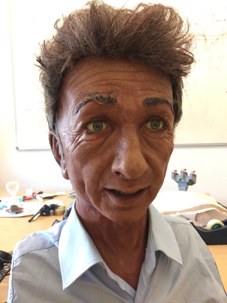

# Charles - the animatronic head

This is the Python code used to drive Charles, an animatronic head created by Hanson Robotics for the Graphics & Interaction Group in the University of Cambridge Computer Lab.  You can see him in action in [The Emotional Computer](http://www.sms.cam.ac.uk/media/1086225).

One of the key demonstrations of his abilities involves getting him to mimic the facial expressions of a human, which is why the key source file here is called `mimic.py`.  

We do this by analysing facial expressions using [a modified version of FaceLandmarkVid](https://github.com/quentinsf/OpenFace/tree/master/exe/FaceLandmarkVidZmq), part of the [OpenFace toolkit](https://github.com/TadasBaltrusaitis/OpenFace).  Our modified version publishes a few streams of the key facial features using ZeroMQ, and this Python code subscribes to them and causes the servos in Charles's head to move in accordance with the observed movements of the human.

Both programs therefore need to be running simultaneously.

##  Notes on the hardware

Charles has 27 servos to drive the various movements of his head, eyes, mouth, cheeks etc, in two groups.  The seven largest (e.g. head movements and jaw opening) are driven through one serial interface using Dynamixel servos.  The remainder are controlled by an [SSC-32 servo controller](http://www.lynxmotion.com/p-395-ssc-32-servo-controller.aspx), which has a serial interface that we connect to using a USB-to-serial converter.

The result is that two serial ports are used by the Python code; the trick (on Windows at least) is to get the right drivers installed so that both of these are recognised, and then put the appropriate COM ports into `charles.py`.  The SSC32_PORT is for the grey serial lead coming out of Charles's back, and the DYNAMIXEL_PORT is for the USB lead coming out of the beige control box.

On Windows, you'll need to get the right COM port numbers.

On a Mac, you may need to install [a driver for the Prolific USB-Serial adapter](http://www.prolific.com.tw/US/ShowProduct.aspx?p_id=229&pcid=41), and the serial ports will then typically appear as /dev/cu.* or /dev/tty* devices.  Linux should be much the same.

The power control box also takes no less than three power supply connections! 

* The left-hand one is at 16V - this is the power for the larger servos, controlled using the USB2Dynamixel adapter inside the box.

* The middle one is at a nominal 7.5V, but seems to register closer to 12V. This is the 'VL' power for the SSC32 controller in Charles's brain. 
  Through a 5v voltage converter inside the power control box, it also powers a microcontroller, of which more below.

* The right-hand one (6v) - This is the power for the smaller in-head servos controlled by the SSC32 board.

The code needs to tel the SSC32 to turn on servo 0 at position 1000.  This doesn't actually have a servo attached; instead it sends pulses back to the microcontroller in the power control box, which, when it sees them, turns on the relay and so provides power to the other servos controlled by the SSC32.

## Software Requirements

To use the charles.py module, you'll need:

* The [pyssc32](https://pypi.org/project/pyssc32/) library, for talking to the SSC-32 controller.  You can pip install this, but I've included a version in this directory because the official package used only to work on Windows.  I've submitted the patches needed upstream so you could probably remove this in future.

* The [pydynamixel](https://pypi.org/project/pydynamixel/) library for talking to the Dynamixel board.  I've updated this too, so that it works under Python 3.

* Both of these depend on the splendid pyserial library.

In addition, if you're using the mimicking stuff, you'll need pyzmq to connect to the ZeroMQ sockets exposed by the OpenFace app.

All of the above should be correctly installed if you

    pip install -r requirements.txt

## Getting started

Once you have the software, the sequence for getting going on a new machine is roughly:

* Connect up the power supplies
* Connect the USB/serial cables to the laptop (typically via a hub)
* Turn on the two power switches on the beige control box
* Make sure that the serial drivers are working (e.g. by checking them in Device Manager).  Install necessary drivers if not. 
* Put the serial port details into `charles.py`

You can run 'charles.py' and you should see some basic movements.  If you have the jupyter notebook system installed, there's also a CharlesPlay notebook here which will let you control individual servos.

To get Charles to mimic you, you need FaceLandmarkVidZmq, which you may need to build for your platform. (See the standard OpenFace instructions.) Then:

* Run FaceLandmarkVidZmq, e.g. with `FaceLandmarkVidZmq -device 0`, and check it is tracking your face through the camera
* Run `mimic.py` and Charles should start to respond.

